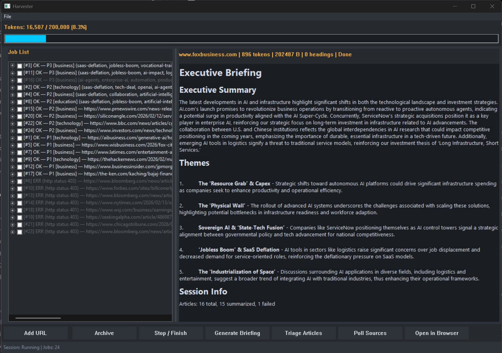

# web_page_filet_mignon
<p align="left">
  
</p>

Serve your LLM the premium cut. `web_page_filet_mignon` is a Rust workspace for collecting web pages, extracting clean text, triaging and summarizing articles, and exposing the resulting corpus.

You need an OpenAI API key, but the costs are intentionally kept low by pushing as much work as possible into deterministic processing.

## What Is In This Repo

- `harvester_app` — the native desktop application
- `harvester_batch` — batch-oriented ingestion/export pipeline
- `scripts/` — the batch launcher and supporting PowerShell utilities
- `docs/` — architecture notes, plans, prompt context, and engineering diary

## Prerequisites

- Rust toolchain with `cargo`
- PowerShell 7 for the batch launcher and supporting scripts
- `OPENAI_API_KEY` set in the environment if you want smart-query features

## Common Commands

Build the workspace:

```powershell
cargo build
```

Run the desktop app:

```powershell
.\scripts\Start-HarvesterApp.ps1
```

Launch the batch workflow:

```powershell
.\scripts\Start-HarvesterBatch.ps1
```

## Harvester Output

The Harvester tools operate on an `output/` directory containing harvested article markdown files plus derived caches such as:

- `harvester-corpus.json`
- `.sources.ron`
- `.entity_index.ron`
- `.summary_cache.ron`
- `.triage_cache.ron`

`harvester-corpus.json` is the public corpus format marker for applications
that read the output folder directly. Its `schema_version` is the compatibility
signal for the article layout. External readers should treat root `*.md` files
and `linked/*.md` files as article records, and should treat hidden `.ron` files
as Harvester-internal state. See [docs/CorpusFormat.md](docs/CorpusFormat.md).
The editable source registry is stored as `output/.sources.ron` by default, so
backing up the output directory also preserves the configured web sources.

For day-to-day use across multiple worktrees, each worktree runs its own binaries against its own `output/` folder.

## Documentation

- [docs/ApplicationDescription.md](docs/ApplicationDescription.md)
- [docs/Architecture.md](docs/Architecture.md)
- [docs/CorpusFormat.md](docs/CorpusFormat.md)
- [docs/PromptContextFiles.md](docs/PromptContextFiles.md)
- [docs/ThreatModel.md](docs/ThreatModel.md)
