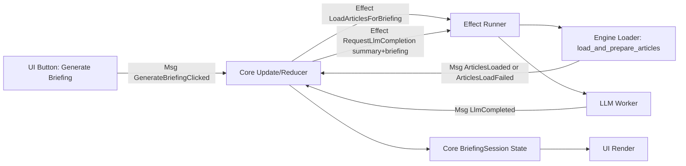

# Architecture

## Purpose and scope
This document describes the overall system shape, centered on a unidirectional data flow. It focuses on responsibilities and boundaries that should remain stable as features evolve.

## Unidirectional data flow (UDF)
1. Inputs create intent messages.
2. A pure update step derives the next state and emits effect requests.
3. Effects perform all I/O and return results as new messages.
4. Views render read-only snapshots of state.

### Briefing runtime diagram

Key rules:
- The update step is deterministic and free of side effects.
- Effects are isolated and the only place where I/O happens.
- State is the single source of truth and is not mutated outside the update step.
- Rendering never mutates state and never triggers I/O directly.

## System responsibilities
- **Input handling:** user actions and timers create messages.
- **State management:** a single authoritative state tracks session, work items, progress, and UI-facing snapshots.
- **Content pipeline:** downloading, extraction, conversion, safety checks, budgeting, and persistence are executed as effects.
- **Corpus contract:** output folders publish `harvester-corpus.json` with a `schema_version`; external readers may depend on the documented Markdown article layout, not on hidden cache/state files.
- **LLM workflow:** request orchestration, validation, and replay are executed as effects with results fed back into state.
- **Rendering:** UI is a projection of state, designed for fast updates and clear feedback.

## Determinism and robustness
- Stable ordering, identifiers, and output formats keep behavior reproducible.
- Corpus schema changes are versioned through `CORPUS_SCHEMA_VERSION` and documented in `docs/CorpusFormat.md`.
- Resource usage is bounded by quotas and budgets.
- All failures are surfaced as explicit outcomes and never silently ignored.

## Security and trust boundaries
- External content is untrusted and treated as data only.
- Persisted data is untrusted when reloaded.
- Model outputs are untrusted until validated and never cause side effects directly.
- All I/O flows through effect handling with policy checks.

## Planned evolution (aligned with current plans)
- **Preview flow:** deliver extracted content through the message pipeline for in-session inspection, with a fallback to on-demand loading after restart.
- **Executive briefing:** a multi-step, message-driven workflow that loads completed content, summarizes it, and produces an aggregate briefing with partial-failure tolerance.
- **Automation path:** future input sources (such as feeds) and scheduled runs remain subject to the same unidirectional flow and security boundaries.
- **Batch API automation path:** `harvester_batch --batch-api` diverts only cache-keyed article triage, summary, and signal-candidate requests after the reducer emits them. The runner freezes the cache identity and rendered messages, durably reserves `.batch_manifest.ron` before creating provider work, and later snapshots completed JSONL before returning `Msg::BatchResultsCollected`. `DeferredToBatch` settles the current cycle; the runner's next-cycle re-arm message enables ordinary cache-hit replay. Collected output remains untrusted until the reducer validates it, and collection writes caches only—normal replay performs article completion and downstream effects.

## Crates and purposes
- **harvester_app:** UI, event loop, effect execution, and platform integration.
- **harvester_core:** domain state, update logic, and view-friendly snapshots.
- **harvester_engine:** content processing pipeline, persistence, and LLM-related workflows.
- **engine_logging:** shared logging setup used across the workspace.
- **commanductui:** UI framework dependency used for the Windows interface.

## External dependencies (selected)
- **reqwest:** HTTP fetching with TLS.
- **tokio:** async runtime and scheduling.
- **serde / serde_json:** structured data serialization.
- **url:** URL parsing and normalization.
- **html2md / scraper:** HTML extraction and conversion.
- **chrono:** timestamps and time handling.
- **thiserror / anyhow:** error modeling and context.
- **log / simplelog:** logging facade and output.

## Glossary
- **Message:** a discrete intent or result that drives state changes.
- **Effect:** an I/O request issued by the update step.
- **State:** the single source of truth for application behavior.
- **View snapshot:** a read-only projection of state for rendering.
- **Pipeline:** the ordered stages that transform external content into outputs.
- **Replay:** cached model inputs and outputs used for auditability and cost control.
