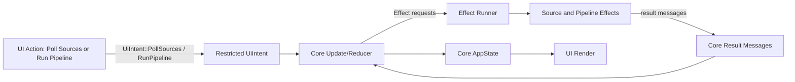

# Architecture

## Purpose and scope
This document describes the overall system shape, centered on a unidirectional data flow. It focuses on responsibilities and boundaries that should remain stable as features evolve.

## Unidirectional data flow (UDF)

1. Inputs create intent messages.
2. A pure update step derives the next state and emits effect requests.
3. Effects perform all I/O and return results as new messages.
4. Views render read-only snapshots of state.

### Reducer-owned pipeline lifecycle

The desktop pipeline has three reducer-owned concepts. `RunProgress` is an accumulator
that retains completed stage counts and bounded activity after live poll and load sessions
are cleared. `PipelineRunPhase` drives the merged triage-and-summary action through
reducer messages; the desktop core thread only reads the phase to decide whether to send
an advance message. `AppState::pipeline_activity()` is the single pure completion query
used by both desktop and batch hosts. It counts pending and in-flight work (never deferred
Batch API work), and deliberately includes signal scoring so neither host settles early.

### Desktop intent runtime diagram

```mermaid
flowchart LR
    UI[UI Action: Poll Sources or Run Pipeline]
    I[Restricted UiIntent]
    U[Core Update/Reducer]
    E[Effect Runner]
    P[Source and Pipeline Effects]
    M[Core Result Messages]
    S[Core AppState]
    R[UI Render]

    UI -->|UiIntent::PollSources / RunPipeline| I
    I --> U
    U -->|Effect requests| E
    E --> P
    P -->|result messages| M
    M --> U
    U --> S --> R
```

Key rules:
- The update step is deterministic and free of side effects.
- Effects are isolated and the only place where I/O happens.
- Runtime-state persistence is a reducer-emitted `PersistRuntimeState` effect:
  its snapshot is captured from the post-update state and the `EffectRunner`
  hands it to a host-selected sink. Normal hosts inject the debounced worker;
  dry-run injects a no-op sink. Hosts never schedule or capture persistence
  snapshots themselves.
- State is the single source of truth and is not mutated outside the update step.
- Rendering never mutates state and never triggers I/O directly.

## System responsibilities
- **Input handling:** user actions and timers create messages.
- **State management:** a single authoritative state tracks session, work items, progress, and UI-facing snapshots.
- **Content pipeline:** downloading, extraction, conversion, safety checks, budgeting, and persistence are executed as effects.
- **Corpus contract:** output folders publish `harvester-corpus.json` with a `schema_version`; external readers may depend on the documented Markdown article layout, not on hidden cache/state files.
- **LLM workflow:** request orchestration, validation, and replay are executed as effects with results fed back into state.
- **Rendering:** UI is a projection of state, designed for fast updates and clear feedback.

## Incremental corpus preparation

`EffectRunner` owns one process-lifetime `CorpusScanIndex` from `harvester_engine`.
The index lists article files on each scan, reuses metadata when length and modification
time match, reads new or changed files, and forgets deleted files. It retains URL, title,
fetched time, content hash and article/non-article status, but no text. Clearing the
imported corpus resets this index through an effect. The index is never persisted and
does not change the public corpus format.

Cold reads and budget-driven re-preparation use a chunked worker pool.
`LoadArticlesForTriage` carries held URL/content-hash identities and their preparation
budgets. Its response contains one first-filename match per requested URL in download
order, the current
summary preparation budget, and prepared text only for missing or differently budgeted
identities. The budget subtracts the effective summary template overhead, including
saved overlays, from the configured input limit. Content hashes derive from untruncated
clean text; a budget change does not change identity. This path builds no aggregate
collection text. Scan counts and timings are logged with the request ID as `[corpus-index]`.

The reducer merges these deltas into pre-triage, preserving verdicts for unchanged
identities, replacing changed preparation, evaluating new identities and removing departed
members. The hand-off to triage makes pre-triage non-actionable while retaining preparation
for later deltas. Refresh demand does not erase pre-triage or reset it to Loading.
`pipeline_activity().intake_refresh_pending` counts pending demand, in-flight loads and
processing-start preparation; both hosts therefore wait for refresh completion before
starting triage or summaries.

A triage start loads contexts, saved template overlays and LLM metadata as one ordered
configuration operation. A standalone summary start does the same; summaries following
triage reuse its configuration. Background refreshes do not begin a configuration snapshot.
Only triage starts require the ArticleTriage context. A failed processing start preserves
an already completed session.
Before either stage dispatches, the reducer checks the stored preparation budget against
the snapshot budget and requests a delta load when necessary. A failed or mismatched
preparation cannot dispatch model work. Summaries take their text directly from the triage
session. `LoadArticlesForBriefing` remains available for the aggregate-briefing domain
path. Stage order and separate model concurrency limits are unchanged.

## Determinism and robustness
- Stable ordering, identifiers, and output formats keep behavior reproducible.
- Corpus schema changes are versioned through `CORPUS_SCHEMA_VERSION` and documented in `docs/CorpusFormat.md`.
- Resource usage is bounded by quotas and budgets.
- All failures are surfaced as explicit outcomes and never silently ignored.

## Security and trust boundaries
- External content is untrusted and treated as data only.
- Persisted data is untrusted when reloaded.
- Model outputs are untrusted until validated and never cause side effects directly.
- All I/O flows through effect handling with policy checks.

## Planned evolution (aligned with current plans)
- **Preview flow:** deliver extracted content through the message pipeline for in-session inspection, with a fallback to on-demand loading after restart.
- **Executive briefing:** a multi-step, message-driven workflow that loads completed content, summarizes it, and produces an aggregate briefing with partial-failure tolerance; its domain state remains tested, but the desktop UI no longer exposes an entry point.
- **Automation path:** future input sources (such as feeds) and scheduled runs remain subject to the same unidirectional flow and security boundaries.
- **Batch API automation path:** `harvester_batch --batch-api` diverts only cache-keyed article triage, summary, and signal-candidate requests after the reducer emits them. The runner freezes the cache identity and rendered messages, durably reserves `.batch_manifest.ron` before creating provider work, and drains that work in-process through status peeks and collect-only cycles with source polling suppressed after intake. `DeferredToBatch` settles the current cycle; the runner's next-cycle re-arm message enables ordinary cache-hit replay. Collected output remains untrusted until the reducer validates it, and collection writes caches only—normal replay performs article completion and downstream effects.
- **Batch API drain path:** `harvester_batch --drain` implies the Batch API runtime and reconnects to work an earlier run already submitted. It never polls sources, so its first cycle is already collect-only, and it exits after one collection pass rather than waiting for batches that are still running. Because deferred state is reducer-owned and in-memory, a fresh drain has no deferred counters to settle: `.batch_manifest.ron` is the durable record that decides what remains outstanding. Batches that end cancelled, expired, or failed are downloaded before their entries are released, so output the provider already produced and billed is salvaged; requests the provider never returned become line errors and are released for a later attempt.

## Crates and purposes
- **harvester_batch:** command-line and scheduled batch host orchestration.
- **harvester_core:** domain state, update logic, and the single desktop view
  projection. `AppState::view()` builds the bounded desktop job list directly;
  retired frozen-renderer geometry, headers, visible-ID arrays, and manual
  pre-triage filter statuses are absent from core and IPC.
- **harvester_engine:** content processing pipeline and LLM-related workflows.
- **harvester_io:** shared runtime paths, effect execution, and persistence. Its
  `EffectRunner` owns an injected runtime-persistence sink, so the same effect
  boundary services both hosts while write-free modes can choose a no-op sink.
  `harvester_io::host_bootstrap` is the shared home for executable-host startup
  and state hydration. `harvester_io::run_lock` provides the parameterized
  single-instance lock shared by the batch and GUI hosts.
- **harvester_ui_bridge:** Tauri-free IPC projection, intent decoding, asset
  confinement, and the core-thread boundary for the desktop host. Its snapshot
  projection carries only rows the page can render; the driver does not capture
  state for I/O. `ShowArchiveDialog` is intercepted for the host and never
  reaches the effect runner.
- **harvester_ui:** non-default Tauri desktop host. It serves only the built frontend bundle through the confined `harvester://` scheme, sends restricted `UiIntent` values to the core-thread driver, and services effects only through `harvester_io::EffectRunner`. The bridge's snapshot projection and host-serviced `ShowArchiveDialog` boundary keep Tauri out of core/reducer logic.
- **engine_logging:** shared logging setup used across the workspace.

## External dependencies (selected)
- **reqwest:** HTTP fetching with TLS.
- **tokio:** async runtime and scheduling.
- **serde / serde_json:** structured data serialization.
- **url:** URL parsing and normalization.
- **html2md / scraper:** HTML extraction and conversion.
- **chrono:** timestamps and time handling.
- **thiserror / anyhow:** error modeling and context.
- **log / simplelog:** logging facade and output.

## Glossary
- **Message:** a discrete intent or result that drives state changes.
- **Effect:** an I/O request issued by the update step.
- **State:** the single source of truth for application behavior.
- **View snapshot:** a read-only projection of state for rendering.
- **Pipeline:** the ordered stages that transform external content into outputs.
- **Replay:** cached model inputs and outputs used for auditability and cost control.
