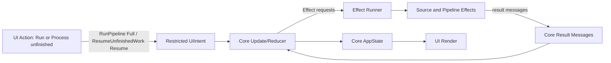

# Architecture

## Purpose and scope
This document describes the overall system shape, centered on a unidirectional data flow. It focuses on responsibilities and boundaries that should remain stable as features evolve.

## Unidirectional data flow (UDF)

1. Inputs create intent messages.
2. A pure update step derives the next state and emits effect requests.
3. Effects perform all I/O and return results as new messages.
4. Views render read-only snapshots of state.

### Reducer-owned pipeline lifecycle

The reducer owns process-lifetime triage, summary and scoring sessions and a
`PipelineWaves` release ledger. Entries retain the key under which they completed;
identities leaving the window are removed. Admission is independent for each stage:
missing, failed or stale completed work becomes pending, while current results and
pending or in-flight entries remain unchanged. Stale results remain in caches.
Each identity is admitted at most once per stage per run; a later run can retry failures.

`PipelineRunRequested` carries Full (intake and processing) or Resume (the current
window). Resume upgrades an active poll run
to Full. Compatible requests join the active run. A run arms model dispatch only when
AI is available; Full otherwise performs intake only. Configuration loads once before
the run's first preparation read and model dispatch, then stays fixed. Hydration
discovers unfinished work without admitting scoring. Import completion uses Resume
to process the current window without starting another source poll.

Both hosts overlap intake and processing: triage can start after the quiet
interval while later downloads continue. Admissions split in window order at
four times the synchronous request budget. A triage wave releases completed,
summary-eligible members in the same reducer step once no pending or in-flight
member remains. Identity and upstream-key markers prevent duplicate downstream
releases. Summaries release scoring per article.
Within a stage, dispatch follows wave and member order. Across stages, scoring precedes
summary, then triage, all sharing one request budget. Indexed queues and changed-wave
tracking keep completion work bounded without rebuilding the full ledger per dispatch.

`AppState::pipeline_activity()` is the single settlement query for both hosts. It
counts admitted pending and in-flight work plus intake refresh demand, loads and
processing preparation. A run becomes Terminal exactly once after intake closes
and activity settles. Hosts pump `PipelineRunAdvance` while their dispatch loops
run. A Full or Resume run arms model work only when AI is available; an unarmed
Full run still polls and becomes Terminal after intake settles. Batch and import
hosts mark a missing or empty API key unavailable before requesting a run.
The command-line host performs one Full cycle (poll, download, process, exit).
Browser-page import starts Resume after importing; checkpoint commands remain
separate operations. The command-line and import loops use a 60-second monotonic
no-progress watchdog: a received message or in-flight operation restarts its
deadline. Quiet downloads do not exhaust an iteration cap. A stalled loop logs
its pipeline/import operation and phase through `engine_logging` before failing.
An accepted Stop moves the run to Stopping, disarms model dispatch, closes intake,
and withdraws never-dispatched Pending entries from triage, summary, and scoring
without failing them. The engine cancels queued downloads while the in-flight
download completes; in-flight model results are applied, cached, and persisted.
No downstream work is released during the drain. Completion counters continue to
advance, and the run remains Stopping until downloads, model work, and intake
refreshes have settled. It then becomes Terminal and the session returns to Idle.
The download engine keeps its in-flight fetch alive for Finish and rejects any
enqueue after Stop until `StartSession` dispatches an explicit Resume command.
Resume creates a fresh cancellation token before the new run's first enqueue, so
another Full run can poll and download without restarting. Withdrawn and never-started identities remain
unfinished under their current keys.

Archive availability is owned by core and depends only on run state: it is disabled
while a run is Active or Stopping, and enabled after Terminal regardless of failed
or unfinished articles. Both opening the archive dialog and submitting an export
are gated by this state; a rejected submit reports that export is unavailable while
a run is in progress. Desktop snapshots expose `archive_enabled` and `run_state`
(`Idle`, `Active`, or `Stopping { in_flight }`) as IPC fields.

The desktop's primary Run action requests Full (poll, download and process). Process
unfinished requests Resume without fetching and is enabled only when AI is available
and the reducer's stored unfinished-work summary is known and nonzero. The view also
provides both actions' enablement, the unfinished count and disabled reason, and any
non-blocking reprocess notice; rendering does not classify work. Poll Sources is not
part of the desktop intent vocabulary. Stop remains separate and destructive, and
reads `Stopping…` while in-flight work drains. Open stage totals have no ETA; a stage
with no admitted work while its total remains open reads “Waiting for articles.”

`RunProgress` accumulates this run's admitted totals, including triage and summary
cache hits. Scoring already completed under the same digest is not readmitted. Multiple
stages can be Active together; model stages become Done only at Terminal. Totals grow
with waves, and `total_is_final` becomes true once upstream can add no more members.
Every stage is terminal when the run is Terminal. Wave releases and the initial
reprocessing notice use `engine_logging` with run and count context; they do not consume
the bounded 50-entry activity feed.

### Desktop intent runtime diagram

```mermaid
flowchart LR
    UI[UI Action: Run or Process unfinished]
    I[Restricted UiIntent]
    U[Core Update/Reducer]
    E[Effect Runner]
    P[Source and Pipeline Effects]
    M[Core Result Messages]
    S[Core AppState]
    R[UI Render]

    UI -->|RunPipeline Full / ResumeUnfinishedWork Resume| I
    I --> U
    U -->|Effect requests| E
    E --> P
    P -->|result messages| M
    M --> U
    U --> S --> R
```

Key rules:
- Paid model results use one generic in-memory store and one append-only JSON Lines
  implementation for triage, summaries and signal candidates, without size or age
  eviction. The reducer emits only newly inserted or updated records in `SaveResults`;
  hydration emits no save. `EffectRunner` owns an injected, ordered result sink next to
  the runtime-persistence sink. It coalesces for at most about two seconds from the first
  unsaved record and flushes at reducer requests on run end and Stop, runner drop, and
  desktop close.
- The I/O layer migrates RON through a flushed, re-read temporary file before renaming
  it to JSONL. RON backups stay byte-identical and are never dual-written. Invalid or
  unknown-version RON sources and unreadable stores refuse AI with a filename and reason;
  metadata refresh cannot clear this refusal. Intake remains available. Complete malformed
  JSONL lines are logged with line numbers and errors and skipped without rewriting;
  later records for a key win. Unterminated tails are saved to sidecars before truncation.
  Store reads, recovery and appends share an in-process lock so a reader in the same
  host cannot truncate a live write. Separate hosts need a folder-level lock.
- The update step is deterministic and free of side effects.
- Effects are isolated and the only place where I/O happens.
- Runtime-state persistence is a reducer-emitted `PersistRuntimeState` effect:
  its snapshot is captured from the post-update state and the `EffectRunner`
  hands it to a host-selected sink. Normal hosts inject the debounced worker;
  tests and fixtures may inject a no-op sink. Hosts never schedule or capture persistence
  snapshots themselves.
- State is the single source of truth and is not mutated outside the update step.
- Rendering never mutates state and never triggers I/O directly.

## System responsibilities
- **Input handling:** user actions and timers create messages.
- **State management:** a single authoritative state tracks session, work items, progress, and UI-facing snapshots.
- **Content pipeline:** downloading, extraction, conversion, safety checks, budgeting, and persistence are executed as effects.
- **Corpus contract:** output folders publish `harvester-corpus.json` with a `schema_version`; external readers may depend on the documented Markdown article layout, not on hidden cache/state files.
- **LLM workflow:** request orchestration and validation are executed as effects with results fed back into state. The synchronous path writes replay records for forensic review; it never reads them to satisfy requests.
- **Rendering:** UI is a projection of state, designed for fast updates and clear feedback.

## Incremental corpus preparation

`EffectRunner` owns one process-lifetime `CorpusScanIndex` from `harvester_engine`.
The index lists article files on each scan, reuses metadata when length and modification
time match, reads new or changed files, and forgets deleted files. It retains URL, title,
fetched time, content hash and article/non-article status, but no text. Clearing the
imported corpus resets this index through an effect. The index is never persisted and
does not change the public corpus format.

Cold reads and budget-driven re-preparation use a chunked worker pool.
`LoadArticlesForTriage` carries held URL/content-hash identities and their preparation
budgets. Its response contains one first-filename match per requested URL in download
order, the current
summary preparation budget, and prepared text only for missing or differently budgeted
identities. The budget subtracts the effective summary template overhead, including
saved overlays, from the configured input limit. Content hashes derive from untruncated
clean text; a budget change does not change identity. This path builds no aggregate
collection text. Scan counts and timings are logged with the request ID as `[corpus-index]`.

The reducer merges these deltas into pre-triage, preserving verdicts for unchanged
identities, replacing changed preparation, evaluating new identities and removing departed
members. The hand-off to triage makes pre-triage non-actionable while retaining preparation
for later deltas. Refresh demand does not erase pre-triage or reset it to Loading.
`pipeline_activity().intake_refresh_pending` counts pending demand, in-flight loads and
processing-start preparation; both hosts therefore keep the run open until refresh completion.

An armed run loads contexts, saved template overlays and LLM metadata as one ordered
configuration operation. Every stage and later intake wave reuses that snapshot.
Background refreshes do not begin a configuration snapshot.
Only triage starts require the ArticleTriage context. A failed processing start preserves
an already completed session.
Before either stage dispatches, the reducer checks the stored preparation budget against
the snapshot budget and requests a delta load when necessary. A failed or mismatched
preparation cannot dispatch model work. Summaries take their text directly from the triage
session. Summary settlement saves per-article results and completes without another model request.

## Shared article-model request budget

`update/model_dispatch.rs::dispatch_model_work` schedules admitted triage, summary
and signal-scoring work after reducer messages. All three stages share
`llm_max_in_flight`, clamped by `harvester_engine::llm::MAX_LLM_CONCURRENT_REQUESTS`
(10); the LLM worker uses the same cap. Desktop uses `LLM_MAX_CONCURRENT_REQUESTS`
(default 3). Batch uses `--llm-concurrency` (default 10, maximum 10).

The scheduler selects scoring, then summaries, then triage, in that fixed priority
order. Within each stage it preserves admission order. Cache hits complete without
occupying a request slot; priority is reconsidered after each completion, including
cache hits that admit downstream scoring. A freed slot goes to the highest-priority
pending stage. Hydration admits no scoring; eligible unscored articles are unfinished
work until a run admits them through this scheduler.

Scoring admission requires triage under the current triage key and a summary under
the current summary key, from the summary session or a current-key cache lookup.
Historical summaries found by URL cannot supply scoring inputs. Each scoring entry
retains its input-key digest and a frozen input snapshot while pending or in flight.
A changed digest replaces a completed or failed score. Pending entries update their
input snapshot without another admission count; in-flight entries keep
their original request until it settles. A same-digest admission is refused.
Successful summary sessions retain their cache
identity so scoring can validate their provenance.

The 1,000-call session quota halts article-model dispatch for the process lifetime
and shows a restart warning on later run starts. Provider out-of-credits and three
consecutive provider rate-limit failures halt the current run; the next explicit
triage or summaries start clears those halts and their warnings. Each halt fails
admitted pending entries across all three stages with its reason; in-flight requests
can finish. Completions from replaced sessions do not create a scheduler halt.

### Identity-based completeness

The pure classifier evaluates each pre-triage window member by its URL and content
hash. The reducer uses the same current-key builders as article dispatch: triage must
hit its current cache key, summaries must hit their current summary key, and signal
scoring must hit the key built from those current upstream results. A stale or failed
stage result does not make the member complete. Pre-triage exclusions and articles
below the applicable priority cutoffs do not request model work. Admitted pending,
and in-flight work is reported as in progress, including a pending
stage entry that has not yet received its dispatch-time key. Unadmitted work is only in
the completeness summary and never enters a stage queue or `pipeline_activity()`.

`AppState::unfinished_stage_verdicts()` reports the triage, summary, and scoring
verdicts for one URL and content-hash identity. A downstream verdict is Unknown
until its current-key upstream result exists. The aggregate uses the first
actionable stage for each member. `AppState::unfinished_work()` reads a stored
aggregate with counts for each classification, the number of window articles
needing an unadmitted stage, and an upper-bound
call estimate: three calls per article needing triage, two per article needing a
summary, and one per article needing scoring. It is Unknown until the article-stage
prompt metadata and contexts are available. Relevant state mutators advance an
input revision. The reducer rebuilds the aggregate after global inputs or broad
session changes and refreshes the affected identity after an article completion,
along with identities affected by cache eviction. A quota halt rebuilds it after
pending entries are failed. View and snapshot construction only read state and
never recompute this aggregate.

The triage cache also keeps a skipped-from-persistence alias index keyed by content
hash for current-metadata lookups. Each alias carries the cached priority used by
cache-derived archive coverage, avoiding a full cache-key allocation and second
cache lookup per included article. Cache hydration rebuilds the index, while writes
and eviction keep it aligned with the authoritative cache entries.

The live triage session indexes article URLs to their positions, preserving first-entry
lookup and first-completed-result precedence when duplicate URLs occur. Pre-triage
indexes the first filter entry by URL and stores its unresolved-review count; set,
merge, replacement, and manual-decision operations refresh those values. The
reducer also stores cache-derived archive scores aligned with the included URL set.
Global input-revision changes rebuild that score index; triage cache writes and
evictions refresh only affected content hashes. Views rank the stored scores with
the same archive selection policy used by dialog and export actions.

Each job stores its canonical archive URL key when its URL is created or changed.
The reducer maintains a job-token index on restore and token progress; duplicate
canonical keys retain the later job's tokens. The view and archive dialog use one
token-estimate helper and read this index without rebuilding it. These indexes are
derived state, are not persisted, and do not perform a window scan on article
completion.

The pure reprocess-notice evaluator uses named defaults: more than 150 previously
in-window articles needing work, or an estimate strictly greater than 50 percent of
the remaining session call quota. Equality at either threshold does not trigger the
notice. Recording the result at initial admission, logging it, and displaying it are
owned by the run surface and host lifecycle. Batch startup reduces metadata and the
restored article window before its first intake cycle, then prints the stored
unfinished count. A host prints the reducer-recorded notice after initial admission.

## Determinism and robustness
- Stable ordering, identifiers, and output formats keep behavior reproducible.
- Corpus schema changes are versioned through `CORPUS_SCHEMA_VERSION` and documented in `docs/CorpusFormat.md`.
- Resource usage is bounded by quotas and budgets.
- All failures are surfaced as explicit outcomes and never silently ignored.

## Security and trust boundaries
- External content is untrusted and treated as data only.
- Persisted data is untrusted when reloaded.
- Model outputs are untrusted until validated and never cause side effects directly.
- All I/O flows through effect handling with policy checks.

## Planned evolution (aligned with current plans)
- **Preview flow:** deliver extracted content through the message pipeline for in-session inspection, with a fallback to on-demand loading after restart.
- **Automation path:** future input sources (such as feeds) and scheduled runs remain subject to the same unidirectional flow and security boundaries.

## Crates and purposes
- **harvester_batch:** command-line and scheduled batch host orchestration.
- **harvester_core:** domain state, update logic, and the single desktop view
  projection. `AppState::view()` builds the bounded desktop job list directly;
  retired frozen-renderer geometry, headers, visible-ID arrays, and manual
  pre-triage filter statuses are absent from core and IPC.
- **harvester_engine:** content processing pipeline and LLM-related workflows.
- **harvester_io:** shared runtime paths, effect execution, and persistence. Its
  `EffectRunner` owns an injected runtime-persistence sink, so the same effect
  boundary services both hosts while write-free modes can choose a no-op sink.
  `harvester_io::host_bootstrap` is the shared home for executable-host startup
  and state hydration, including the shared environment check for AI
  availability. `harvester_io::run_lock` uses one `.harvester.lock` per output
  folder across the command-line host, desktop host, and IPC probe. Lock
  metadata identifies the holder, and a competing start reports its host, PID,
  and start time. `source_loader` reads the registry entry by entry: unknown or
  removed source types are skipped with a warning that identifies their
  registry path, position and readable id, while valid entries load with existing validation.
  File and CuratedList remain supported source types.
  Runtime persistence includes reducer-owned pending intake. A poll completing
  after Stop and downloads cancelled before starting are saved for the next
  Full run, which ingests them before polling. A pending URL with a successful
  or non-cancelled failed job is discarded; only URLs with no job or solely
  cancelled jobs are released from URL deduplication. Resume processes unfinished
  window work without fetching pending-intake URLs.
- **harvester_ui_bridge:** Tauri-free IPC projection, intent decoding, asset
  confinement, and the core-thread boundary for the desktop host. Its snapshot
  projection carries only rows the page can render; the driver does not capture
  state for I/O. `ShowArchiveDialog` is intercepted for the host and never
  reaches the effect runner.
- **harvester_ui:** non-default Tauri desktop host. It serves only the built frontend bundle through the confined `harvester://` scheme, sends restricted `UiIntent` values to the core-thread driver, and services effects only through `harvester_io::EffectRunner`. The bridge's snapshot projection and host-serviced `ShowArchiveDialog` boundary keep Tauri out of core/reducer logic.
- **engine_logging:** shared logging setup used across the workspace.

## External dependencies (selected)
- **reqwest:** HTTP fetching with TLS.
- **tokio:** async runtime and scheduling.
- **serde / serde_json:** structured data serialization.
- **url:** URL parsing and normalization.
- **html2md / scraper:** HTML extraction and conversion.
- **chrono:** timestamps and time handling.
- **thiserror / anyhow:** error modeling and context.
- **log / simplelog:** logging facade and output.

## Glossary
- **Message:** a discrete intent or result that drives state changes.
- **Effect:** an I/O request issued by the update step.
- **State:** the single source of truth for application behavior.
- **View snapshot:** a read-only projection of state for rendering.
- **Pipeline:** the ordered stages that transform external content into outputs.
- **Replay:** write-only model request and response records retained for forensic review.
